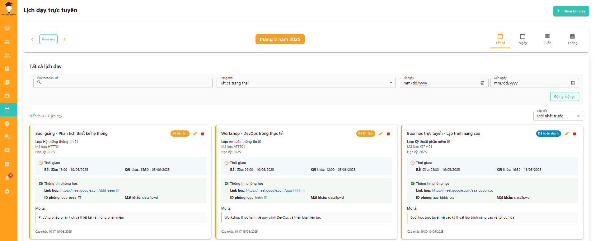
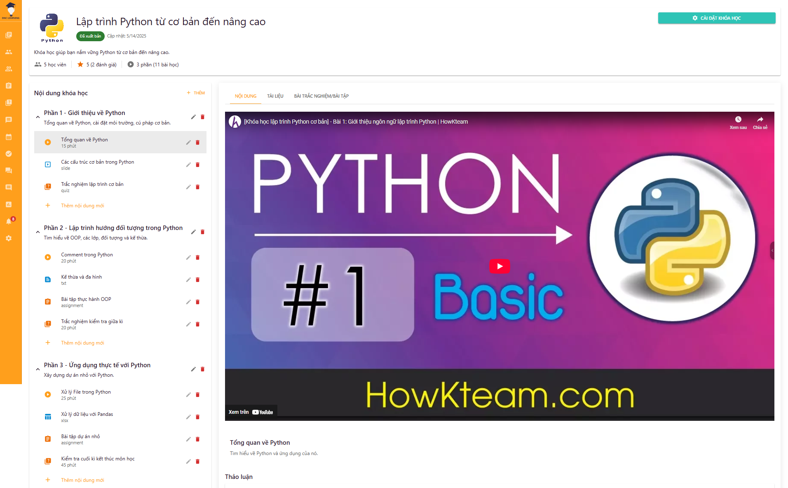

# Learning Management System Screenshots

This document contains screenshots of the Learning Management System (LMS) interface for different user roles.

## Administrator Interface

### Categories (Dialog)

.png)

### Categories

### Chat Dialog

### Lecturer Management (Dialog)

.png)

### Lecturer Management (Access Lecturer Page)

.png)

### Lecturer Management

### Quản lý học viên 2

### Student Management (View Information)

.png)

### Student Management

### Course Management (Dialog)

.png)

### Course Management (View Course Content)

.png)

### Course Management

### Academic Class Management (Dialog)

.png)

### Academic Class Management (Assignment)

.png)

### Academic Class Management (Add Student)

.png)

### Academic Class Management (View List)

.png)

### Academic Class Management

### Payment Management (View Information)

.png)

### Payment Management

### Statistics Management

### Personal Account Management

### Evaluation Management

### Admin Login

## Lecturer Interface

### Chat Dialog

### Quiz Management (Add Quiz for Academic Class)

.png)

### Quiz Management (View Quiz Attempts)

.png)

### Quiz Management (View by Class)

.png)

### Quiz Management

### Assignment Management (Grading)

.png)

### Assignment Management (Add Assignment for Academic Class)

.png)

### Assignment Management (View Submitted Files)

.png)

### Assignment Management

### Forum Management (Dialog)

.png)

### Forum Management (View Forum)

.png)

### Forum Management

### Student Management (Grade Table)

.png)

### Student Management (Academic Warning)

.png)

### Student Management

### Course Management (Dialog)

.png)

### Course Management

### Teaching Schedule Management (Dialog)

.png)

### Teaching Schedule Management

### Academic Class Management (Dialog)

.png)

### Academic Class Management (Add Course)

.png)

### Academic Class Management (Add Student)

.png)

### Academic Class Management (View Students)

.png)

### Academic Class Management

### Course Content Management (Assignments and Quizzes)

.png)

### Course Content Management (Assignment Dialog)

.png)

### Course Content Management (Quiz Dialog)

.png)

### Course Content Management (Add Content)

.png)

### Course Content Management (Add Learning Section)

.png)

### Course Content Management (Add Document)

.png)

### Course Content Management (Documents)

.png)

### Course Content Management (Delete Content)

.png)

### Course Content Management

### Notification Management

### Statistics Management

### Account Management

### Attendance Management

### Evaluation Management

### Lecturer Login

## Student Interface

### Forum Details

### Course Details

### Learning Content Details - Assignment

### Learning Content Details - Quiz

### Learning Content Details - Slides

### Learning Content Details - Video

### Learning Content Details - Text

### Learning Content Details - View Document

### Assignments and Quizzes

### Forums

### Enrolled Courses

### Online Classes

### Lecturer List

### Course List

### Chatbot Interface

### Display Scores and Answers

### Chat Dialog

### Assignment Results

### Take Quiz

### Submit Assignment

### Join Online Learning

### ZaloPay Payment

### Email Notifications

### Notifications

### Lecturer Details

### Homepage

### Personal Page - Grade Table

### Personal Page - Certificates

### Personal Page - Payment

### Personal Page - Learning Progress

### Personal Page

### Search Information

### Course Registration

### Register

### Login

